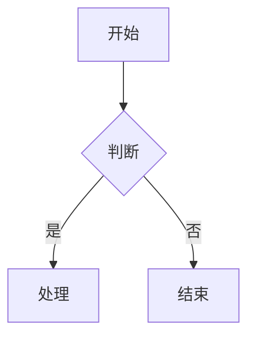
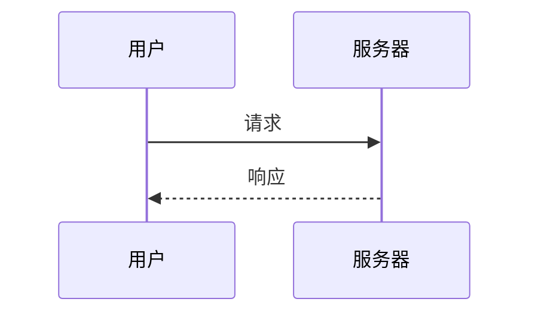

# Web 笔记应用 - 开发上下文记录

## 项目信息

- **项目名称**: Web 笔记应用

## 技术栈

| 技术 | 用途 | 版本/来源 |
|------|------|-----------|
| HTML5 | 页面结构 | - |
| CSS3 | 样式设计 | - |
| JavaScript (ES6+) | 交互逻辑 | - |
| markdown-it | Markdown 渲染 | 本地 (js/markdown-it.min.js) |
| highlight.js | 代码语法高亮 | 本地 (js/highlight.min.js) |
| highlight.js 主题 | github.min.css (亮色) | 本地 (css/github.min.css) |
| mermaid.js | 图表渲染 | CDN (jsdelivr) |

## 文件结构

```
tools/note/
├── index.html              # 主页面
├── css/
│   ├── style.css           # 自定义样式文件
│   └── github.min.css      # highlight.js 主题样式
├── js/
│   ├── app.js              # 主脚本
│   ├── markdown-it.min.js  # Markdown 解析库
│   └── highlight.min.js    # 代码高亮库
├── plan-webNoteApp.prompt.md  # 开发计划
└── context.md              # 上下文记录（本文件）
```

## 功能清单

### 已实现功能

- [x] 主体输入区域（大型 textarea）
- [x] 清除按钮 - 一键清空输入内容
- [x] 开启预览/隐藏预览按钮 - 切换左右分栏预览模式
- [x] 隐藏输入/开启输入按钮 - 切换输入区域显示
- [x] 导出按钮 - 导出为 .md 文件（文件名格式：note-YYYYMMDDHHmmss.md）
- [x] Markdown 实时渲染预览
- [x] 代码语法高亮（使用 highlight.js）
- [x] Mermaid 图表支持（流程图、时序图等）
- [x] 任务列表支持（`- [x]` 和 `- [ ]` 语法）
- [x] Tab 键缩进支持
- [x] 本地数据持久化（localStorage）
- [x] 页面加载时自动恢复数据
- [x] 每次输入自动保存
- [x] 底部字数统计（不含空白字符）
- [x] 页面最外层禁止滚动

### 按钮布局

| 位置 | 按钮 | 初始文本 | 切换后文本 | 颜色 |
|------|------|----------|------------|------|
| 左侧 | 清除 | 清除 | 清除（不变） | 红色 #e57373 |
| 左侧 | 预览 | 开启预览 | 隐藏预览 | 蓝色 #5c9fd4 |
| 左侧 | 输入 | 隐藏输入 | 开启输入 | 绿色 #66bb6a |
| 右侧 | 导出 | 导出 | 导出（不变） | 橙色 #ffa726 |

### UI 主题

- **顶部工具栏**: 淡蓝色背景 `#e8f4fc`
- **底部状态栏**: 淡蓝色背景 `#e8f4fc`（与顶部统一）
- **边框色**: `#c5dff0`

## 核心方法说明

### app.js 方法列表

| 方法名 | 用途 |
|--------|------|
| `init()` | 初始化应用，配置 markdown-it 和 mermaid，绑定事件 |
| `clearContent()` | 清空输入区域和预览区域，重置字数统计 |
| `togglePreview()` | 切换预览模式 |
| `toggleInput()` | 切换输入区域显示/隐藏 |
| `renderMarkdown(text)` | 渲染 Markdown 到预览区，触发 mermaid 渲染 |
| `renderMermaid()` | 渲染预览区中的 Mermaid 图表 |
| `handleTabKey(event)` | 处理 Tab 键缩进 |
| `handleInput()` | 处理输入事件，保存、更新预览和字数统计 |
| `saveToLocal(content)` | 保存内容到 localStorage |
| `loadFromLocal()` | 从 localStorage 加载内容 |
| `updateWordCount(text)` | 更新底部字数统计显示 |
| `exportMarkdown()` | 导出内容为 .md 文件 |
| `enableTaskLists(md)` | 启用任务列表（checkbox）支持 |

## 本地存储

- **存储键名**: `sea-web-note-content`
- **存储内容**: textarea 的纯文本内容
- **存储时机**: 每次输入变化时自动保存

## 资源引用

```html
<!-- 本地样式 -->
<link rel="stylesheet" href="css/style.css">
<link rel="stylesheet" href="css/github.min.css">

<!-- 本地脚本 -->
<script src="js/markdown-it.min.js"></script>
<script src="js/highlight.min.js"></script>
<script src="js/mermaid.min.js"></script>
```

## Mermaid 图表使用

支持在 Markdown 中使用 mermaid 代码块渲染图表：

### 流程图示例

````markdown

````

### 时序图示例

````markdown

````

### Mermaid 语法注意事项

| 问题 | 解决方案 |
|------|----------|
| 名称含空格 | 使用别名 `participant A as User Name` |
| 名称含括号 | 使用别名 `subgraph ID["显示名(含括号)"]` |
| 换行显示 | 使用 `<br>` 而非 `<br/>` |
| 节点重复定义 | 确保每个节点 ID 只定义一次 |

## 任务列表使用

支持 GitHub 风格的任务列表语法：

```markdown
- [x] 已完成任务
- [ ] 未完成任务
- [X] 大写 X 也支持
```

渲染效果为带复选框的列表项，已完成项显示为勾选状态。

## 使用说明

1. 直接在浏览器中打开 `index.html` 文件
2. 在输入区域编写 Markdown 内容
3. 点击「开启预览」查看渲染效果
4. 使用 ` ```mermaid ` 代码块添加图表
5. 内容会自动保存到浏览器本地存储
6. 下次打开页面会自动加载之前的内容
7. 点击「导出」可下载为 .md 文件

## 开发规范

- 所有 JavaScript 方法均添加 JSDoc 注释
- CSS 使用分区注释组织代码
- 使用语义化的 HTML 结构
- 保持代码注释完整
